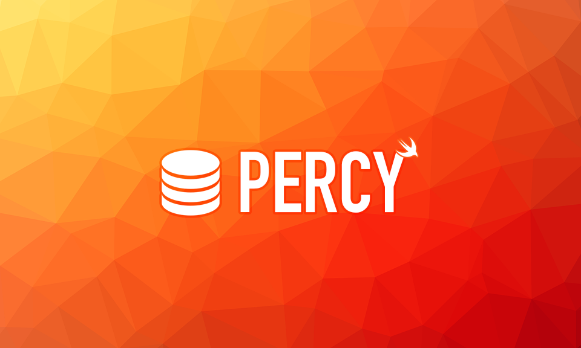

# Percy
> An elegant CoreData wrapper

[](https://travis-ci.org/akoulabukhov/Percy)
[](https://cocoapods.org/pods/Percy)
[](https://cocoapods.org/pods/Percy)
[](https://cocoapods.org/pods/Percy)



Percy is a CoreData based library written in Swift that allows you to separate the data persistence implementation from the rest of the application. Main goals of this library are:

* Provide ready-to-use persistence layer for your application
* Separate common application logic from using NSManagedObjects by using standard PONSO model objects
* Allow for clear and simple one-line operations (create, read, update, delete)
* Eliminate anxiety when accessing stored objects from different threads
* and much more ...

The main part of library is Persistable protocol. It includes requirements to your model objects to associate them with NSManagedObject and convert them in both directions.

## How to start using Percy

1. Create ``.xcdatamodel`` CoreData model describing your persistent layer (with enabled code-gen for NSManagedObjects).
2. Create entitiy struct (preferred) or class which you want to persist.

```swift
struct Post {
  let id: Int
  var text: String
}
```

3. Conform your entity to ``Persistable`` protocol (in example PostObject is NSManagedObject stored in CoreData).

```swift
import Percy

extension Post: Persistable {

  init(object: PostObject, in context: OperationContext) throws {
    id = Int(object.id)
    text = object.text!
  }

  func fill(object: PostObject, in context: OperationContext) throws {
    object.id = Int32(id)
    object.text = text
  }

}
```
4. Now your Post entity can be persisted in Percy!

```swift
let percy = try! Percy(dataModelName: "MyDataModel")

// Save post
let post = Post(id: 1, text: "My new note")
try! percy.upsert(post)

// Retrieve saved post
let predicate = Post.makeAssociatedObjectPredicate(id: 1)
let savedPost: Post = percy.first(predicate: predicate, sortDescriptors: nil)!
```

Percy comes with custom CoreData stores support (e.g. EncryptedCoreData) and classes, which allow you to track store updates.

## Changes tracking

There are two classes allowing you to track database contents and its changes.

### LiveList

`LiveList` - class that stores array of `Persistable` objects. This list can be _filtered with NSPredicate and sorted with custom function_ if needed. You can use it as Data Source for `UITableView` or `UICollectionView`.

Usage is pretty simple:
1. Ask instance of `Percy` for a LiveList with required filter and sorting.
2. Set `onChange` closure to perform row operations with your Table or Collection.
3. Alternatively you can just call `reloadData()` in `LiveList.onFinish` closure.

### ChangeObserver

`ChangeObserver` - class which not stores objects in memory, but instead can just notify about _some object was added, updated or deleted_. `ChangeObserver` also supports filtering. This can be useful with non-UI modules of your app, like _notifications schedulers, synchronization mechanisms and so on_.

Examples of using `LiveList` and `ChangeObserver` can be found in **Percy.xcworkspace**.

## Example

To run the example project, clone the repo, and run `pod install` from the Example directory first.

## Requirements

- iOS 9.0+
- Xcode 10+

## Installation

Percy is available through [CocoaPods](https://cocoapods.org). To install
it, simply add the following line to your Podfile:

```ruby
pod 'Percy'
```

## TODO

- [ ] Implement tests
- [ ] Add grouping functions support

## Contribute

We would love you for the contribution to **Percy**

## Authors

Alexander Kulabukhov, wowid@list.ru

## Meta

Percy is available under the MIT license. See the ``LICENSE`` file for more info.
